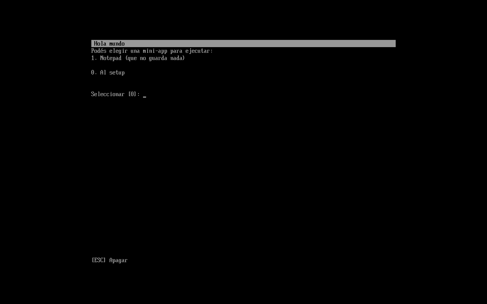
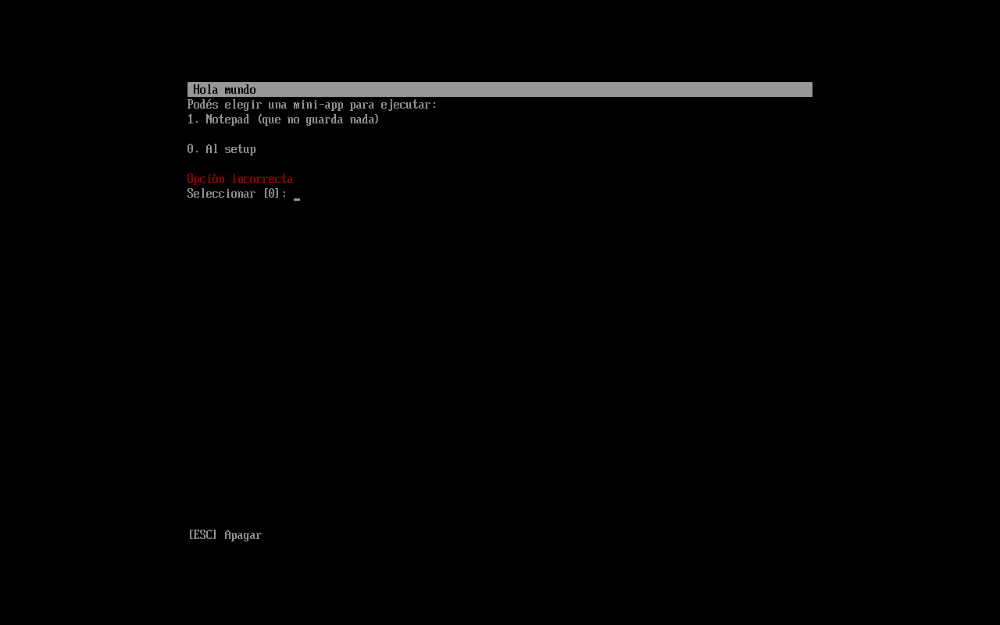
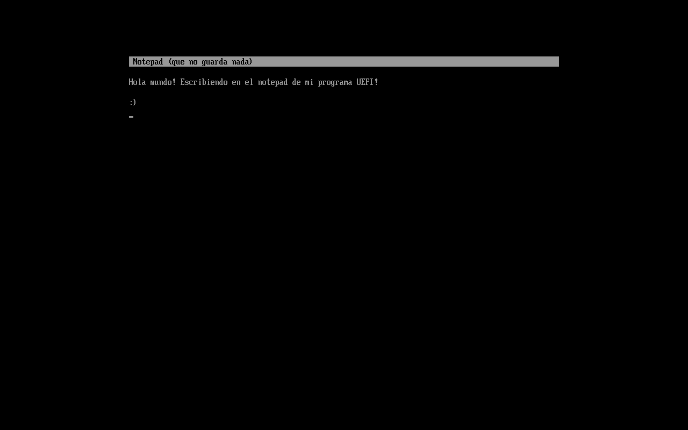

# uefi-hello-world

Hola mundo para UEFI.

## Dependencias

Requiere una versión **nightly** de Rust.

## Objetivo del proyecto

Siempre quise aprender Rust en algún momento, por ser un lenguaje seguro y altamente performante, pero nunca encontraba
ningún proyecto adecuado para ponerme manos a la obra, considero que es un lenguaje muy escandaloso para cosas simples
como una API REST, y quería ir por algo más interesante.

A su vez, siempre quise algún día escribir bootloaders y programas en bare-metal, la sola idea me hacía sentir poderoso
y orgulloso de mis conocimientos. Ya lo había logrado en Assembler, así que mi plan era hacerlo con un lenguaje de un 
poco más alto nivel.

Al mezclarse ambas cosas, un día mi cabeza explotó y ahí estaba mi proyecto: un bootloader escrito en Rust. Sinceramente
no busqué mucho sobre una interfaz con BIOS porque encontré el crate `uefi` mucho más rápido, y teniendo en cuenta que
eso me ahorraría el escándalo de tener que pasar a modo protegido, y además funcionaría en máquinas de este siglo, me
pareció lo más pertinente.

Sin mucho más, acá mi pequeño proyecto.

## Funcionamiento

Para salir del ejemplo de imprimir "Hola mundo" por stdout, decidí hacer un poco de todo: stdout, stdin, y pequeñas
complejidades.

### Primera etapa: el selector de mini-apps.

El programa tiene una primera etapa en la que imprime las mini-apps disponibles en un listado, y te permite
seleccionarlas con un número (el selector de mini-apps es una mini-app en sí misma). Las mini-apps no son más que 
funciones que toman parámetros en común, como la `SystemTable<Boot>` de UEFI para acceder a los métodos estilo 
`stdout()` y `stdin()`, o a veces incluso `boot_services()` para manejar ciertos eventos.

### Segunda etapa: dentro de la mini-app.

Una vez en la mini-app, se implementa el comportamiento deseado. En mi caso, la mini-app de ejemplo que hice es un 
"notepad", que en realidad solamente replica las teclas que uno presiona en pantalla (stdin --> stdout). Al presionar la
tecla `[ESC]` se cierra la mini-app para volver al selector.

El cierre se maneja devolviendo en la función un `MiniAppExitCode`, que no es más que un enum con el código de salida. 
Hasta el momento hay tres: `RestartApp`, `ExitApp` y `Shutdown`. El manejo de los exit codes son jerárquicos, por lo 
que, en este caso, el selector es quien decide qué se hace. Hoy en día reinicia la app al recibir `RestartApp`, vuelve
al selector al recibir `ExitApp`, e ignora `Shutdown`.
La función que controla al selector, por otro lado, reinicia el selector al recibir `RestartApp`, finaliza la ejecución
del proceso UEFI al recibir `ExitApp` (esto en consecuencia nos redirige al setup UEFI), y apaga el equipo al recibir
`Shutdown`.

Mientras no se quiera cerrar la mini-app, basta con controlar su ejecución dentro de un loop, y romperlo solamente
cuando se quiera finalizar su ejecución, devolviendo un exit code.

## Compilación

El target de compilación es `x86_64-unknown-uefi`, está configurado por defecto en 
[.cargo/config.toml](.cargo/config.toml) junto con otras directivas relevantes como compilar std para este target.

Como dice más arriba, es necesaria una versión **nightly** de Rust para poder utilizar las características _unstable_.

## Screenshots

